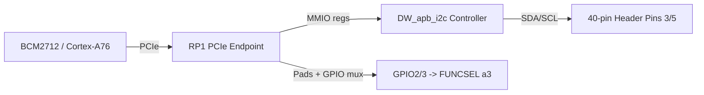
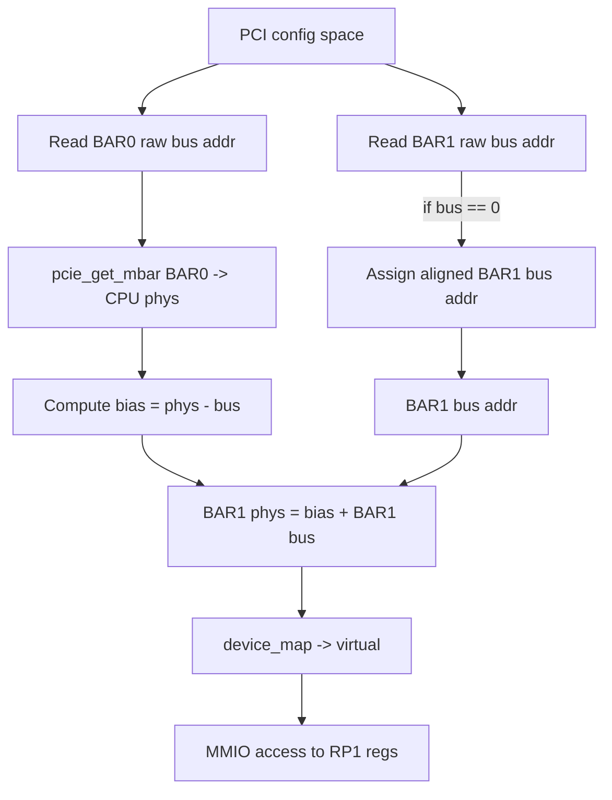
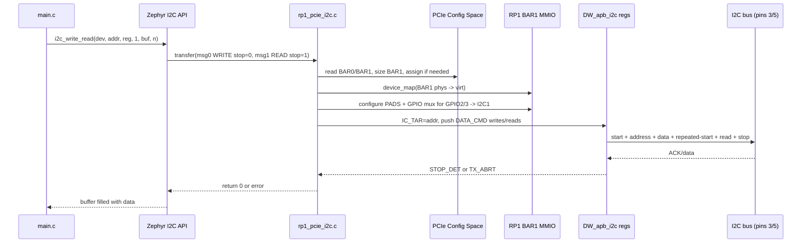

# RPi5 RP1 PCIe I2C Bring-up on Zephyr

Bring-up documentation and reference implementation for accessing **Raspberry Pi 5** low-speed peripherals that live behind the **RP1 I/O controller**, with a specific focus on **I2C1 on GPIO2/GPIO3 (header pins 3/5)** from **bare-metal Zephyr**.

## Overview

On Raspberry Pi 5, the familiar 40-pin header peripherals are not exposed directly by the BCM2712 in the same way older Raspberry Pi boards worked. Instead, the **BCM2712 (Cortex-A76)** reaches the **RP1** companion chip over **PCIe**, and the RP1 then exposes GPIO, I2C, SPI, pads, and pinmux controls.

That means the path for I2C on header pins 3/5 is effectively:

**A76 CPU -> PCIe Root Complex -> RP1 PCIe Endpoint -> RP1 peripheral MMIO -> DW_apb_i2c controller -> GPIO2/GPIO3 pinmux -> header pins 3/5**

Linux hides this behind the normal Raspberry Pi software stack. In **bare-metal Zephyr**, this repository recreates the minimum plumbing needed to make it work.

---

## Why this repository exists

This repo exists to answer a very practical bring-up question:

> How do you make **I2C1 on pins 3/5** work on **Raspberry Pi 5** from **Zephyr**, when the controller sits behind **RP1 over PCIe**?

The work captured here covers:

- RP1 PCIe endpoint enumeration
- RP1 BAR discovery and assignment
- MMIO mapping of RP1 peripheral space
- RP1 pad and GPIO mux programming
- polling-mode DesignWare I2C transfers
- correct **repeated-start** handling for `i2c_write_read()`
- end-to-end validation using a real I2C device such as **TCS3408**

---

## Hardware topology

### ASCII view

```text
+--------------------------+                     +--------------------------+
| BCM2712 (RPi5 SoC)       |                     | RP1 (I/O controller)     |
|  - Cortex-A76 cores      |   PCIe link         |  - GPIO banks            |
|  - PCIe Root Complex     +-------------------->+  - I2C controllers       |
|  - DRAM + MMU            |                     |  - Pads + pinmux         |
+--------------------------+                     +-----------+--------------+
                                                            |
                                                            | GPIO2/3 -> I2C1
                                                            v
                                                     +--------------+
                                                     | 40-pin header|
                                                     | Pin 3: SDA   |
                                                     | Pin 5: SCL   |
                                                     +--------------+
```

### Mermaid view



---

## What this repository implements

The Zephyr-side solution is a **custom PCIe-backed I2C driver** that does the following:

1. **Enumerates RP1 over PCIe**
   - finds the RP1 endpoint at the configured BDF
   - verifies the expected vendor/device ID

2. **Reads and fixes up RP1 BARs**
   - reads BAR0/BAR1 from PCI config space
   - sizes BAR1 using the standard PCI BAR sizing flow
   - assigns BAR1 if firmware left it unassigned

3. **Maps RP1 peripheral space into CPU virtual memory**
   - derives the host translation bias
   - computes BAR1 physical address
   - maps the region uncached using `device_map(..., K_MEM_CACHE_NONE)`

4. **Accesses RP1 peripheral MMIO through BAR1**
   - DesignWare I2C controller registers
   - pads configuration registers
   - IO bank pinmux registers

5. **Implements polling-mode DesignWare I2C transfers**
   - `i2c_write()`
   - `i2c_read()`
   - repeated-start capable `i2c_write_read()`

---

## Why BARs matter

RP1 exposes its register space through PCIe **Base Address Registers (BARs)**.

Conceptually:

- **BAR0**: small control / sanity window
- **BAR1**: large peripheral window used for RP1 register space

A common failure mode during bring-up was:

- `BAR0 raw = valid`
- `BAR1 raw = 0x00000000`

That meant the RP1 peripheral window was **not assigned by firmware**, so the A76 had no usable MMIO path to the RP1 register space until BAR1 was explicitly sized and programmed.

### BAR mapping flow



---

## From BAR mapping to working I2C on pins 3/5

Mapping BAR1 is necessary, but not enough. Two more pieces are required.

### 1. Use the correct RP1 I2C instance

Pins **3/5** correspond to **RP1 GPIO2/GPIO3**, which are connected to **I2C1**, not I2C0.

Typical devicetree property:

```dts
rp1-i2c-index = <1>;
```

Typical base computation used by the driver:

```c
RP1_I2C_BASE(i) = 0x40070000 + i * 0x4000
```

### 2. Program pads and pinmux correctly

Even if the DesignWare I2C block is initialized, the external pins will not behave as I2C until RP1 pad and mux registers are set correctly.

For `GPIO2` / `GPIO3`, the driver explicitly configures:

- **PADS_BANK0**
  - input enable
  - pull-up handling
  - Schmitt trigger
  - open-drain-friendly behavior

- **IO_BANK0 GPIOx_CTRL**
  - `FUNCSEL = a3` / function select value `3`
  - routes I2C1 SDA/SCL to the header pins

---

## I2C engine used by this project

RP1 uses a **Synopsys DesignWare APB I2C** controller (`DW_apb_i2c`).

### Driver initialization

The driver performs a minimal polling-mode init sequence:

- disable controller
- configure standard / fast mode timing
- program `IC_CON`
  - master mode
  - restart enabled
  - target speed
  - slave disabled
- clear interrupt state
- enable controller

### Transfer flow

For each transaction:

- lock driver state
- program target address via `IC_TAR`
- push write bytes or read commands through `IC_DATA_CMD`
- poll `IC_RAW_INTR_STAT`
- wait for `STOP_DET` or `TX_ABRT`
- return success / failure back to Zephyr

---

## The important fix: repeated-start support

A major bring-up issue was combined transactions such as:

1. write a register address
2. issue a repeated-start
3. read back data

That is the pattern Zephyr uses for `i2c_write_read()` and the pattern many sensors require.

The driver must therefore:

- **not force STOP** after the first write message
- only generate STOP on the final message
- preserve the write-then-read sequence correctly

Once repeated-start handling was fixed, register reads from devices such as **TCS3408** succeeded.

Example validation log:

```text
TCS3408: ID=0x18 REVID=0x53
```

---

## Devicetree integration

A typical overlay adds a custom I2C node such as:

```dts
rp1_i2c1: rp1_i2c1 {
    compatible = "brcm,rp1-pcie-i2c";
    label = "RP1_I2C1";
    clock-frequency = <100000>;
    rp1-i2c-index = <1>;
    /* optional PCI BDF / BAR properties */
};
```

Application code then retrieves the device using the Zephyr devicetree API:

```c
#define RP1_I2C_NODE DT_NODELABEL(rp1_i2c1)
static const struct device *const i2c_dev = DEVICE_DT_GET(RP1_I2C_NODE);
```

The driver is registered with `DEVICE_DT_INST_DEFINE()` and appears to the application like a normal Zephyr I2C controller.

---

## Suggested repository structure

```text
app/rp1_pcie_i2c/
├── CMakeLists.txt
├── prj.conf
├── boards/
│   └── rpi_5.overlay
├── include/
│   └── uart_cmd.h
└── src/
    ├── main.c
    ├── rp1_pcie_i2c.c
    └── uart_cmd.c
```

### `CMakeLists.txt`

```cmake
target_sources(app PRIVATE
  src/main.c
  src/rp1_pcie_i2c.c
  src/uart_cmd.c
)

target_include_directories(app PRIVATE
  ${CMAKE_CURRENT_SOURCE_DIR}/include
)
```

### `prj.conf`

Your exact configuration depends on your Zephyr baseline, but this app typically needs:

- logging
- I2C subsystem
- UART console / shell support
- PCIe support for `rpi_5`
- any custom Kconfig symbols used by the RP1 driver

---

## Build and run

> Update paths and west workspace names to match your repository.

### Build

```bash
west build -b rpi_5 app/rp1_pcie_i2c -p always
```

### Flash / boot

Follow the normal `rpi_5` Zephyr flow:

1. build `zephyr.bin`
2. copy it to the boot media
3. ensure the correct DTB and `config.txt` are present
4. boot with UART enabled for bring-up logs

---

## Validation strategy

### Software validation

1. Confirm PCIe enumeration of RP1
2. Read BAR0 / BAR1 from config space
3. Size and assign BAR1 if raw value is zero
4. Map BAR1 and confirm stable MMIO reads/writes
5. Program RP1 pads and pinmux for `GPIO2/3 -> I2C1`
6. Probe a known I2C device
7. Validate `i2c_write_read()` transactions

### Physical validation

Use a logic analyzer or oscilloscope to confirm:

- SCL toggles on pin 5
- SDA activity on pin 3
- correct 7-bit target address
- repeated-start behavior
- ACK / NACK behavior

---

## End-to-end call flow



---

## Known limitations

This implementation is currently **bring-up quality**, not production hardened.

Current limitations include:

- polling mode only
- no interrupt-driven transfer path yet
- limited bus recovery
- pragmatic BAR assignment in bare-metal flow
- pin electrical tuning may need refinement for different pull-up / capacitance conditions

---

## Key takeaways

- On **Raspberry Pi 5**, low-speed header I/O is mediated by **RP1**, not directly by the A76 cluster.
- For **bare-metal Zephyr**, I2C on **pins 3/5** requires both:
  - **PCIe-backed RP1 BAR mapping**, and
  - **explicit RP1 pad/pinmux programming**.
- The final piece that makes real sensors work is proper **repeated-start** handling in the I2C transfer path.

---

## Status

- [x] RP1 PCIe enumeration
- [x] BAR discovery
- [x] BAR1 sizing / assignment when uninitialized
- [x] BAR1 MMIO mapping
- [x] RP1 pad + mux setup for GPIO2/3
- [x] polling-mode I2C transfers
- [x] repeated-start support
- [x] sensor register read validation
- [ ] interrupt-driven I2C path
- [ ] production-grade error recovery
- [ ] upstream-quality cleanup and generalization

